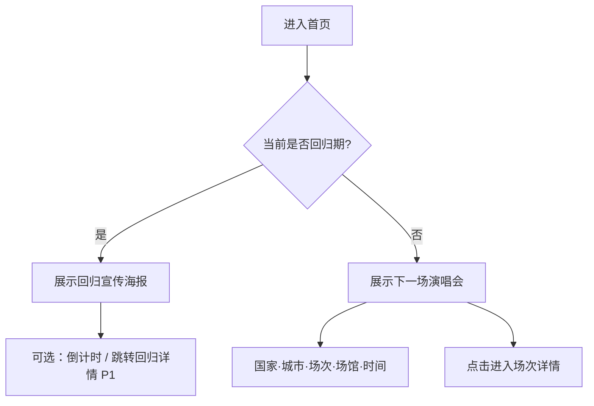
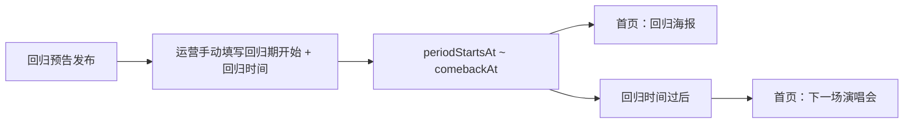

# ITZY 团体官网 · 产品设计文档（PRD）

> 文档版本：v1.2  
> 角色：产品经理  
> 范围：演唱会管理、娃娃管理、歌曲应援管理、首页策略、回归管理、留言板  
> 说明：纯产品设计，不涉及代码实现

---

## 1. 产品概述

### 1.1 背景

ITZY 粉丝（MIDZY）需要一处集中查阅**演唱会场次**、**WDZY / Twinzy 娃娃图鉴**、**歌曲应援（喊口号）** 的官网。现有 itzy-app 已有行程、相册等基础能力；本 PRD 按业务实际重新定义三大核心模块，并明确首页展示策略与后续模块规划。

### 1.2 产品定位

| 维度 | 定义 |
|------|------|
| 一句话 | ITZY 粉丝站 — 查场次、认娃娃、练应援 |
| 目标用户 | MIDZY（核心）、新粉、演唱会到场粉丝 |
| 价值主张 | 场次信息结构化、娃娃按系列归档、应援词与歌词对齐可查 |

### 1.3 产品目标

1. **场次可查**：按巡演 / FM 轮次 → 国家 → 城市 → 场次 → 场馆 → 时间，层级清晰
2. **娃娃可认**：WDZY、Twinzy 两大系列，五位成员各款可查，关联上架轮次
3. **应援可练**：歌曲歌词与喊口口号位置一一对应，现场前可快速复习
4. **首页聚焦**：非回归期展示「下一场演唱会」；回归期展示回归宣传海报

---

## 2. 功能总览

| 优先级 | 模块 | 说明 |
|--------|------|------|
| P0 MVP | 演唱会管理 | 巡演 / FM 轮次 + 国家城市场次场馆时间 |
| P0 MVP | 娃娃管理 | WDZY / Twinzy，五位成员，关联轮次与尺寸 |
| P0 MVP | 歌曲应援管理 | 歌词对应喊口口号，便于管理与展示 |
| P0 MVP | 首页 | 下一场演唱会 **或** 回归宣传海报（二选一） |
| P0 MVP | 回归管理 | 预告后手动配置回归期，首页自动切换海报 |
| P0 MVP | 留言板 | 访客可直接留言，公开展示需审核 |

---

## 3. 信息架构（IA）

```
ITZY 官网
├── 首页
│   ├── 【回归期】回归宣传海报（全宽主视觉）
│   └── 【非回归期】下一场演唱会卡片（唯一一条）
├── 演唱会
│   ├── 按活动类型浏览（巡演 / FM）
│   ├── 轮次列表（一巡、二巡… / 一 FM、二 FM…）
│   └── 场次详情（国家 · 城市 · 场次 · 场馆 · 时间）
├── 娃娃
│   ├── WDZY 图鉴
│   ├── Twinzy 图鉴
│   └── 成员维度（Yeji / Lia / Ryujin / Chaeryeong / Yuna）
├── 歌曲应援
│   ├── 曲目列表
│   └── 应援详情（歌词 + 喊口位置高亮）
├── 回归
│   └── 回归期配置、宣传海报
└── 留言板
    ├── 发表留言（访客开放）
    └── 留言墙展示
```

**管理后台（Admin）**

```
Admin
├── 演唱会管理
│   ├── 活动轮次（巡演 / FM）
│   ├── 场次（国家、城市、场次号、场馆、时间）
│   └── 场馆主数据
├── 娃娃管理
│   ├── WDZY / Twinzy 娃娃录入
│   └── 关联上架轮次
├── 歌曲应援管理
│   ├── 曲目维护
│   └── 歌词行 + 应援标注编辑
├── 回归管理
│   ├── 回归期起止时间
│   └── 宣传海报
└── 留言板管理
    └── 留言审核 / 删除
```

---

## 4. 模块一：演唱会管理

### 4.1 要解决的问题

粉丝查场次时信息散乱：分不清「二巡首尔第二场」和「三巡东京场」，国家城市场馆时间常常对不上。

### 4.2 业务层级（核心结构）

演唱会数据按**四层**组织：

```
活动类型 + 轮次（TourCycle）
  └── 国家（Country）
        └── 城市（City）
              └── 场次（Show / Session）
                    ├── 场次序号（统一 Day 1 / Day 2）
                    ├── 场馆（Venue）
                    └── 时间（startsAt / endsAt）
```

**活动类型与轮次枚举**

| 类型 | 轮次示例 | 说明 |
|------|----------|------|
| 巡演（TOUR） | 一巡、二巡、三巡 | WORLD TOUR 等 |
| 粉丝见面会（FM） | 一 FM、二 FM、三 FM、四 FM、五 FM | 各次 Fan Meeting |

> 轮次在后台作为「活动周期」主数据维护，一场演唱会必须归属某一轮次。

### 4.3 功能范围

#### 4.3.1 用户端

| 功能 | 说明 | MVP |
|------|------|-----|
| 按轮次浏览 | 先选「三巡」或「二 FM」，再看下属场次 | ✅ |
| 场次列表 | 展示：国家、城市、场次号、场馆、日期时间 | ✅ |
| 场次详情 | 完整信息 + 封面/备注 | ✅ |
| 筛选 | 按国家、城市、时间范围 | ✅ |
| 下一场推荐 | 自动计算「未来最近一场」供首页使用 | ✅ |

#### 4.3.2 管理端

| 功能 | 说明 | MVP |
|------|------|-----|
| 轮次 CRUD | 类型（巡演/FM）+ 轮次名称 + 排序 | ✅ |
| 场次 CRUD | 绑定轮次，填写国家、城市、场次号、场馆、时间 | ✅ |
| 场馆主数据 | 国家、城市、场馆名（可与现有 Venue 对齐） | ✅ |
| 发布控制 | 未发布场次仅后台可见 | ✅ |
| 批量导入 | Excel 按轮次导入多场 | P1 |

### 4.4 核心数据模型

**活动轮次 TourCycle**

| 字段 | 类型 | 必填 | 说明 |
|------|------|------|------|
| type | 枚举 | ✅ | `TOUR` / `FM` |
| title | 文本 | ✅ | 如「三巡」「二 FM」 |
| remark | 文本 | 可选 | 备注 |
| sortOrder | 数字 | 可选 | 列表排序 |

**场次 Show（即对外展示的「一场演唱会」）**

| 字段 | 类型 | 必填 | 说明 |
|------|------|------|------|
| tourCycleId | 关联 | ✅ | 所属轮次 |
| countryCode / countryName | 文本 | ✅ | 国家 |
| city | 文本 | ✅ | 城市 |
| sessionLabel | 文本 | ✅ | 场次标识，统一格式 `Day 1`、`Day 2`… |
| venueId | 关联 | ✅ | 场馆 |
| startsAt | 时间 | ✅ | 开场时间 |
| endsAt | 时间 | 可选 | 结束时间 |
| title | 文本 | 可选 | 展示标题，默认可自动生成：`{轮次} · {城市} · {场次}` |
| coverUrl | 图片 | 可选 | 场次封面 |
| description | 文本 | 可选 | 备注 |
| published | 布尔 | ✅ | 是否对外展示 |
| sortOrder | 数字 | 可选 | 同城市多场次排序 |

**场馆 Venue**

| 字段 | 说明 |
|------|------|
| countryName | 国家 |
| city | 城市 |
| venueName | 场馆全称 |
| posterDisplayName | 海报/列表用简称 |

### 4.5 列表展示示例

| 轮次 | 国家 | 城市 | 场次 | 场馆 | 时间 |
|------|------|------|------|------|------|
| 三巡 | 韩国 | 首尔 | Day 1 | KSPO DOME | 2026-03-15 18:00 |
| 三巡 | 日本 | 东京 | Day 1 | 东京巨蛋 | 2026-04-02 17:00 |
| 二 FM | 韩国 | 首尔 | Day 1 | 蚕室 | 2025-11-20 14:00 |

### 4.6 与现有项目关系

itzy-app 已有 `Schedule`、`TourCycle`、`Venue` 及 Admin 行程页。产品侧建议将「Schedule」语义对齐为**场次（Show）**，并强化 **轮次类型（巡演/FM）+ 国家 + 城市 + 场次号** 字段，而非泛化「行程标签」。

---

## 5. 模块二：娃娃管理

### 5.1 要解决的问题

WDZY、Twinzy 两大娃娃线各自有多轮上架，每位成员款式不同，粉丝需要按系列、成员、轮次快速辨认。

### 5.2 概念定义

| 概念 | 说明 |
|------|------|
| WDZY | 娃娃产品线 A（前台仅展示英文 **WDZY**，无中文副标题） |
| Twinzy | 娃娃产品线 B（前台仅展示英文 **Twinzy**，无中文副标题） |
| 成员 | Yeji、Lia、Ryujin、Chaeryeong、Yuna（固定五位） |
| 上架轮次 | 某次巡演或某次 FM 同期上新的娃娃批次 |

**结构关系**

```
娃娃类别（WDZY | Twinzy）
  └── 上架批次（关联：三巡 / 二 FM 等）
        └── 成员款 × 5（每人一款或多款）
              └── 属性：名称、尺寸、图片
```

### 5.3 功能范围

#### 5.3.1 用户端

| 功能 | 说明 | MVP |
|------|------|-----|
| 类别 Tab | 顶部切换 WDZY / Twinzy | ✅ |
| 成员筛选 | 五位成员 Chip 筛选 | ✅ |
| 轮次筛选 | 按巡演 / FM 轮次筛选 | ✅ |
| 图鉴卡片 | 图 + 名称 + 成员 + 尺寸 + 轮次标签 | ✅ |
| 娃娃详情 | 多图、名称、类别、成员、轮次、尺寸 | ✅ |

#### 5.3.2 管理端

| 功能 | 说明 | MVP |
|------|------|-----|
| 娃娃 CRUD | 录入单款娃娃 | ✅ |
| 类别 | 必选 WDZY 或 Twinzy | ✅ |
| 成员 | 必选五位之一 | ✅ |
| 关联轮次 | 必选 TourCycle（如「三巡」「一 FM」） | ✅ |
| 上下架 | published | ✅ |
| 批量录入 | 同一轮次一次录入 5 成员款 | P1 |

### 5.4 核心数据模型

**娃娃 Doll**

| 字段 | 类型 | 必填 | 说明 |
|------|------|------|------|
| category | 枚举 | ✅ | `WDZY` / `TWINZY` |
| name | 文本 | ✅ | 娃娃名称 |
| member | 枚举 | ✅ | Yeji / Lia / Ryujin / Chaeryeong / Yuna |
| tourCycleId | 关联 | ✅ | 哪轮巡演或 FM 上新 |
| size | 文本 | ✅ | 尺寸，如 10cm、15cm |
| images | 图片列表 | ✅ | 至少 1 张 |
| description | 文本 | 可选 | 备注 |
| published | 布尔 | ✅ | 是否展示 |
| sortOrder | 数字 | 可选 | 同轮次同成员排序 |

### 5.5 页面布局建议

**图鉴首页**

```
[ WDZY | Twinzy ]          ← 一级 Tab
[ 全部 | Yeji | Lia | … ]  ← 成员筛选
[ 轮次 ▼ ]                 ← 轮次下拉

┌─────────┐ ┌─────────┐
│  图片   │ │  图片   │
│ 名称    │ │ 名称    │
│ Yeji    │ │ Ryujin  │
│ Tour 3  │ │ Tour 3  │
│ 10cm    │ │ 10cm    │
└─────────┘ └─────────┘
```

**娃娃详情**

- 大图 → 名称
- 属性行：类别 · 成员 · 轮次 · 尺寸
- 可选：同轮次其他成员款快捷横滑

---

## 6. 模块三：歌曲应援管理

### 6.1 要解决的问题

演唱会现场粉丝需在**特定歌词位置**齐声喊应援口号；目前多为图片、PDF 或群文件，不便检索、不便临场查阅，也难以统一更新。

### 6.2 概念定义

| 概念 | 说明 |
|------|------|
| 曲目（Song） | 一首有应援词的歌，如《WANNABE》《LOCO》 |
| 歌词行（LyricLine） | 按行拆分的歌词 |
| 应援段（CheerSegment） | 附着在某行/某句上的喊口内容 |
| 应援类型 | 齐喊 / 成员名 / 自定义口号 / 应和句 |

### 6.3 展示方案（推荐）

采用 **「歌词时间轴 + 行内高亮」** 方案，兼顾管理与现场阅读。

#### 6.3.1 用户端展示

**曲目列表页**

- 按专辑或演出常用曲目排序
- 卡片：曲名、副标题（如「三巡固定曲」）、是否有应援标注

**应援详情页（核心）**

```
┌──────────────────────────────────────┐
│  WANNABE                    [展开全词] │
├──────────────────────────────────────┤
│  普通歌词行（灰色/常规字重）            │
│                                      │
│  ★ 应援行（高亮底 + 左侧图标）        │
│    韩：……                             │
│    中：……                             │
│    喊：「Yeji！」「MIDZY！」           │
│                                      │
│  普通歌词行                           │
│  ★ 应援行                             │
│    喊：「Ryujin！」                   │
└──────────────────────────────────────┘
```

**交互要点**

| 能力 | 说明 |
|------|------|
| 行级高亮 | 需喊口的行用醒目背景色（如 ITZY 品牌色浅底） |
| 韩中对照 | 每行歌词同时展示韩文 + 中文，中文为对照行（字号略小或次要色） |
| 喊口展示 | 应援行在韩中歌词下方展示「喊：xxx」，字号更大 |
| 成员色标 | 喊成员名时用成员代表色（可选 P1） |
| 紧凑模式 | 开关「仅看应援行」，隐藏普通歌词，适合临场复习 |
| 分段折叠 | 按 Verse / Chorus 折叠，长曲目不滚动过载 |

#### 6.3.2 管理端编辑方案

**推荐：行编辑器（类似台词本）**

| 列 | 说明 |
|----|------|
| 序号 | 行号，可拖拽排序 |
| 韩文歌词 | 本行韩文原文（必填） |
| 中文歌词 | 本行中文对照（必填） |
| 是否应援行 | 开关 |
| 喊口内容 | 多行文本，支持多个口号（换行分隔） |
| 备注 | 如「只在副歌第二次」 |

后台保存为「曲目 + 有序歌词行列表」，每行带 `isCheer` 与 `cheerText`。

**录入流程**

1. 新建曲目（曲名、别名、排序）
2. 粘贴韩文歌词 → 自动按行拆分；逐行填写中文对照
3. 逐行勾选「应援行」并填写喊口内容
4. 预览（与用户端一致的紧凑/完整模式）
5. 发布

### 6.4 功能范围

| 功能 | 用户端 | 管理端 | MVP |
|------|--------|--------|-----|
| 曲目列表 | ✅ | CRUD | ✅ |
| 歌词行维护 | — | 行编辑器 | ✅ |
| 应援标注 | 高亮展示 | 勾选 + 喊口文本 | ✅ |
| 仅看应援行 | 紧凑模式 | 预览 | ✅ |
| 关联轮次/场次 | 标注「三巡曲目单」 | 多选 TourCycle | P1 |
| 音视频锚点 | 点击行跳转时间点 | 填 timecode | P2 |

### 6.5 核心数据模型

**曲目 Song**

| 字段 | 类型 | 必填 | 说明 |
|------|------|------|------|
| title | 文本 | ✅ | 曲名 |
| titleAlt | 文本 | 可选 | 中文/别名 |
| sortOrder | 数字 | 可选 | 列表排序 |
| published | 布尔 | ✅ | 是否展示 |

**歌词行 LyricLine**

| 字段 | 类型 | 必填 | 说明 |
|------|------|------|------|
| songId | 关联 | ✅ | 所属曲目 |
| lineNo | 数字 | ✅ | 行序 |
| textKo | 文本 | ✅ | 韩文歌词 |
| textZh | 文本 | ✅ | 中文对照 |
| isCheer | 布尔 | ✅ | 是否应援行 |
| cheerText | 文本 | 条件 | isCheer 时必填，喊口内容 |
| section | 文本 | 可选 | Verse / Pre-Chorus / Chorus 等 |
| note | 文本 | 可选 | 备注 |

### 6.6 数据示例

| lineNo | textKo | textZh | isCheer | cheerText |
|--------|--------|--------|---------|-----------|
| 1 | Cause you know I am… | 因为你知道我是… | false | — |
| 2 | WANNABE | 想成为 | true | MIDZY! |
| 3 | I wanna be me me me | 我想做自己 | false | — |
| 4 | （间奏） | （间奏） | true | Yeji!\nLia!\nRyujin! |

---

## 7. 首页策略

### 7.1 展示规则（二选一，互斥）



| 状态 | 主视觉 | 说明 |
|------|--------|------|
| **回归期** | 回归宣传海报（全宽） | 预告发布后运营手动配置回归期；见 §8.1 |
| **非回归期** | 下一场演唱会（唯一一条） | 取 `published=true` 且 `startsAt > now` 的最近一场 |

### 7.2 下一场演唱会卡片内容

- 轮次标签（如「三巡」）
- 国家 · 城市
- 场次（Day 1 / Day 2）
- 场馆
- 日期时间（含时区说明）
- CTA：查看详情 / 全部场次

### 7.3 回归期海报

- 全宽海报图（支持多图轮播 P1）
- 可选：回归日期倒计时
- 点击跳转回归专题页（P1）或外链

### 7.4 首页其余区块（次要，MVP 可精简）

| 区块 | MVP 建议 |
|------|----------|
| 快捷入口 | 演唱会 / 娃娃 / 歌曲应援 |
| 最近上新娃娃 | 可选 P1 |
| 常用应援曲 | 可选 P1 |

> **MVP 首页原则**：主视觉只占一块——回归海报 **或** 下一场演唱会，避免信息争抢。

---

## 8. 模块四：回归管理

### 8.1 要解决的问题

回归预告发出后，粉丝需要在一段时间内看到统一的回归主视觉，而非下一场演唱会信息。

### 8.2 回归期判定规则（已确认）

1. **触发时机**：官方回归预告发布后，由运营在后台**手动配置**
2. **必填项**：
   - **回归期开始时间**（`periodStartsAt`）：通常为预告上线时刻，运营手动填写
   - **回归时间**（`comebackAt`）：正式回归日/发歌时刻，运营手动填写
3. **回归期范围**：`periodStartsAt ≤ 当前时间 ≤ comebackAt` 期间，**全部算作回归期**
4. **首页行为**：回归期内展示回归宣传海报；过了 `comebackAt` 后自动恢复为「下一场演唱会」



### 8.3 功能范围

| 功能 | 说明 | MVP |
|------|------|-----|
| 回归期配置 | 手动填写开始时间与回归时间 | ✅ |
| 宣传海报 | 上传回归主视觉，首页全宽展示 | ✅ |
| 倒计时 | 距 `comebackAt` 倒计时 | ✅ |
| 预告文案 / MV 链接 | 回归详情补充 | P1 |
| 关联回归曲应援 | 跳转 Song 应援页 | P1 |

### 8.4 核心数据模型

**回归 Comeback**

| 字段 | 类型 | 必填 | 说明 |
|------|------|------|------|
| periodStartsAt | 时间 | ✅ | 回归期开始（预告后手动填入） |
| comebackAt | 时间 | ✅ | 正式回归时间（手动填入） |
| posterUrl | 图片 | ✅ | 回归宣传海报 |
| title | 文本 | 可选 | 回归标题，如专辑名 |
| description | 文本 | 可选 | 预告文案 |
| published | 布尔 | ✅ | 是否启用该回归配置 |

**首页判定逻辑**：取 `published=true` 且 `periodStartsAt ≤ now ≤ comebackAt` 的回归配置；若存在则展示海报，否则展示下一场演唱会。

---

## 9. 模块五：留言板

### 9.1 要解决的问题

粉丝希望向 ITZY 或 MIDZY 社区表达心意，无需注册门槛即可参与。

### 9.2 访问与发表规则（已确认）

- **任何访问者均可留言**，无需登录、无需粉丝认证
- 提交字段：留言内容（必填）+ 昵称（必填，访客自填）
- 发表后进入审核队列；**审核通过**方在留言墙公开展示
- 未通过留言不对其他访客可见

### 9.3 功能范围

| 功能 | 用户端 | 管理端 | MVP |
|------|--------|--------|-----|
| 发表留言 | 表单提交 | — | ✅ |
| 留言墙 | 已通过留言，时间倒序 | — | ✅ |
| 审核 | — | 通过 / 驳回 / 删除 | ✅ |
| 防刷 | 同 IP 频率限制 | 敏感词过滤 | ✅ |
| 回复 / 点赞 | — | — | P2 |

### 9.4 核心数据模型

**留言 Message**

| 字段 | 类型 | 必填 | 说明 |
|------|------|------|------|
| nickname | 文本 | ✅ | 访客自填昵称 |
| content | 文本 | ✅ | 留言正文 |
| status | 枚举 | ✅ | `pending` / `approved` / `rejected` |
| createdAt | 时间 | ✅ | 提交时间 |
| ipHash | 文本 | 可选 | 防刷用，不对外展示 |

---

## 10. 用户故事（修订版）

**P0 — MVP**

| ID | 用户故事 | 验收标准 |
|----|----------|----------|
| US-01 | 作为粉丝，我想按「三巡」「二 FM」查看所有场次 | 轮次 → 场次列表，含国家城市场次场馆时间 |
| US-02 | 作为粉丝，我想在首页看到下一场演唱会 | 非回归期仅展示一条最近未来场次 |
| US-03 | 作为粉丝，我想按 WDZY/Twinzy 和成员查娃娃 | Tab + 成员筛选 + 卡片列表 |
| US-04 | 作为粉丝，我想知道某款娃是哪轮巡演/FM 上的 | 娃娃详情展示 tourCycle |
| US-05 | 作为粉丝，我想对着韩中歌词练应援喊词 | 每行韩+中对照，应援行高亮喊口 |
| US-06 | 作为运营，我想在后台维护场次与娃娃、应援词 | 三套 Admin CRUD |
| US-07 | 作为粉丝，回归预告后我想在首页看到回归海报 | 回归期内展示海报与倒计时 |
| US-08 | 作为访客，我想无需登录即可留言 | 填昵称+内容即可提交 |
| US-09 | 作为粉丝，我想在留言墙看到已通过的留言 | 审核通过后公开展示 |

**P1 — 后续**

| ID | 用户故事 |
|----|----------|
| US-10 | 应援曲标注适用轮次（三巡曲目单） |
| US-11 | 娃娃同轮次五成员批量录入 |
| US-12 | 回归页关联回归曲应援 |

---

## 11. MVP 范围与路线图

### 11.1 MVP 边界

| 模块 | 包含 | 不包含 |
|------|------|--------|
| 演唱会 | 轮次、国家城市场次场馆时间；场次统一 Day 1/Day 2 | 批量导入、票务链接 |
| 娃娃 | WDZY/Twinzy（仅英文）、五成员、轮次、尺寸 | 粉丝晒娃、交换 |
| 歌曲应援 | 韩中双行歌词、应援高亮、紧凑模式 | 音视频 timecode |
| 首页 | 下一场演唱会 **或** 回归海报（按回归期自动切换） | 完整回归专题页 |
| 回归管理 | 手动配置回归期起止、海报、倒计时 | 关联曲目单 |
| 留言板 | 访客开放留言、审核后展示、防刷 | 登录体系、回复点赞 |

### 11.2 路线图

```
Phase 1 (MVP)   演唱会 + 娃娃 + 歌曲应援 + 首页 + 回归 + 留言板
       ↓
Phase 2 (P1)    轮次曲目单关联、回归曲直达、娃娃批量录入
       ↓
Phase 3 (P2)    音视频锚点、留言回复点赞、数据导入
```

---

## 12. 非功能需求

| 类别 | 要求 |
|------|------|
| 性能 | 应援详情长歌词虚拟滚动；图片懒加载 |
| 移动端 | 歌曲应援以手机竖屏阅读为主，字号可调 |
| 时区 | 场次时间标注 KST，可选转换本地时区 |
| 多端 | H5 + 小程序结构一致；Admin 统一维护 |
| 数据 | 软删除；应援/留言改动留版本（P1） |

---

## 13. 产品决策（已确认）

| # | 议题 | 决策 |
|---|------|------|
| 1 | WDZY / Twinzy 命名 | **仅使用英文** WDZY、Twinzy，不加中文副标题 |
| 2 | 场次序号 | 统一 **Day 1、Day 2** 格式（巡演与 FM 均适用） |
| 3 | 应援歌词 | 每行**韩文 + 中文对照**双行展示，均为必填 |
| 4 | 回归期判定 | 回归预告发布后，运营**手动填入**回归期开始时间与回归时间；`periodStartsAt ~ comebackAt` 整段为回归期，首页展示回归海报 |
| 5 | 留言板 | **任何访客均可留言**（无需登录）；公开展示需运营审核通过 |

---

## 14. 总结

| 模块 | 核心价值 | MVP 交付物 |
|------|----------|------------|
| 演唱会管理 | 轮次 → 国家 → 城市 → Day N → 场馆 → 时间 | 结构化场次列表与详情 |
| 娃娃管理 | WDZY / Twinzy × 五成员 × 轮次 | 英文分类图鉴与属性展示 |
| 歌曲应援 | 韩中歌词与喊口口号对齐 | 双语文本 + 行编辑器 + 高亮阅读 |
| 首页 | 单一主视觉 | 回归期海报 或 下一场演唱会 |
| 回归管理 | 预告后手动配置回归档期 | 海报 + 倒计时 + 自动切换首页 |
| 留言板 | 低门槛粉丝互动 | 访客留言 + 审核展示墙 |

各模块通过 **TourCycle（轮次）** 与 **Comeback（回归档期）** 关联：场次与娃娃归属轮次，首页按回归档期切换主视觉，形成统一的活动语境。
