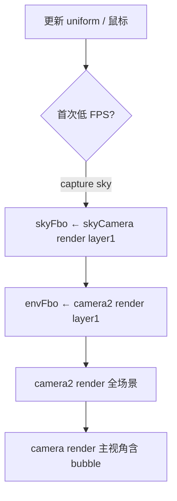

# 02 — WebGL 折射场景

> 证据：生产 bundle `class Ny`（MainScene），Three.js r142

## 渲染管线（每帧 `onRaf`）



- **envFbo**：背景层离屏颜色，供 bubble `uSceneTex` 采样折射
- **skyFbo**：首次运行时捕获 sky 渐变供 Demo1 球内反射
- **camera2**：`layers.set(1)` 仅渲染背景/字模/遮罩层

## 配置（SOURCE）

```js
config = {
  dpr: renderer.getPixelRatio(),
  cameraZOffset: 25,
  mouseMoveAngle: { x: 0.18, y: 0.1 },
  sphereStartScale: 0.75,
  bubbleScale: { landscape: 1, portrait: 0.3 },
}
```

## 核心 Mesh

| 对象 | 几何/材质 | 层 |
|---|---|---|
| backgroundPlane | Plane + `SkyMaterial` (Ay) | 1 |
| lightningPlane | Plane + lightning shader | 1 |
| viewportPlane | Plane + `MaskMaterial` (ku) fill/stroke | 1 |
| fillPlanes top/bottom | Plane + ku (white/black fill) | 1 |
| bubble | Sphere(1,64,32) + `BubbleMaterial` (zu) | 0 |
| boxMesh | Box + bubbleText/metalText GLB | 混合 |

## Bubble Shader (zu) — SOURCE

- **顶点**：可选 Perlin 噪声顶点位移（`USE_DISTORTION`）
- **片元**：16 次 RGB 通道偏移采样 `uSceneTex` + matcap
- 默认：`uRefractPower: 0.2`, `uMatcapOpacity: 0.1`, `uColorOffset: (0.6,0.4,0.4)`

## Sky Shader (Ay) — SOURCE

- uniforms: `uSkyColor` `(0.337,0.72,0.854)`, `uCloudColor` `(0.96,0.96,0.96)`
- Demo2 tween: cloudColor → `(0.149,0.137,0.28)`, `uSkyTweenProgress: 1`

## Lightning — SOURCE

```glsl
float yPos = smoothstep(1.0 * uProgress, 1.0, st.y);
gl_FragColor = vec4(tex.rgb, yPos * alphaTex.r);
```

Demo 切换时 `uProgress` → `-2` 播放闪电扫过。

## GLB 模型

| 文件 | 用途 | 缩放 |
|---|---|---|
| `unseen-dc.glb` | Demo1 chrome 字 | `0.0067` |
| `metal-dc.glb` | Demo2 金属字 | `0.44`, position `(0,0.033,-0.01)` |

环境贴图：`cubemap/`（chrome）、`metalCubemap/`（metal）

## GSAP Timelines

| Timeline | 触发 |
|---|---|
| `sceneSwitchTl` (Cy) | Demo 01→02 |
| `scene1MouseDownTl` (Ly) | Demo1 按住 |
| `scene2MouseDownTl` (Py) | Demo2 按住 |

## 待验证 gap

- [ ] FPS 自适应 DPR 降级逻辑
- [ ] OrbitControls（bundle 含但可能未启用）
- [ ] 精确 loader outline stroke 时长
